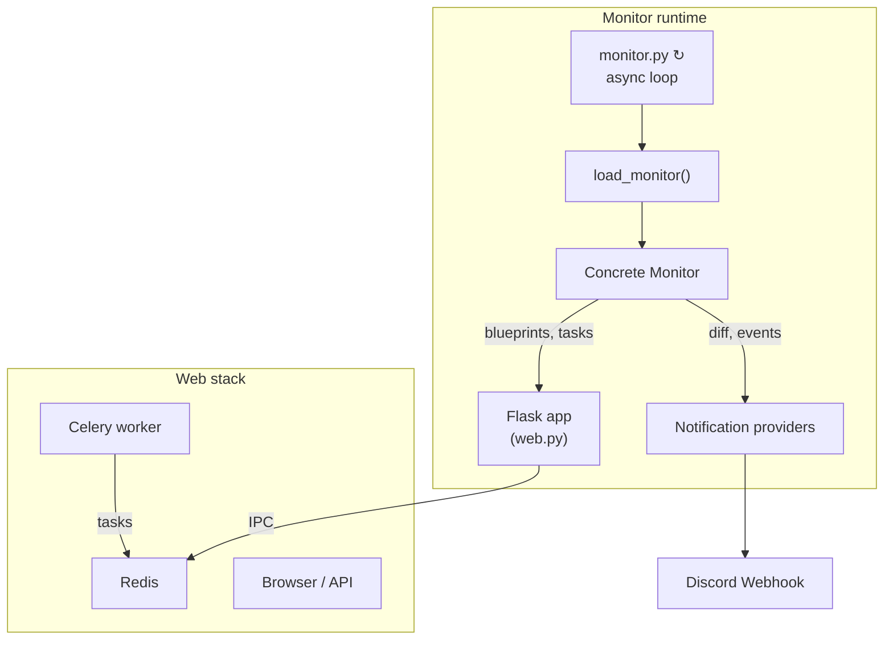

# WhitneyMonitor

WhitneyMonitor is a **modular permit-monitoring & notification framework** originally built to watch recreation.gov quotas for Inyo National Forest.  The core has since been generalised so that **additional monitors, tools and notification providers can be plugged-in with minimal effort**.


---

## Features

* 🔌 **Pluggable architecture** – drop new monitor or notification providers under `providers/` and declare them in *conf.yaml*.
* 🕵️ **Async monitoring loop** driven by `asyncio` – hundreds of requests per second without blocking.
* 📈 Built-in *Statistics* & *Core* blueprints exposing runtime info via Flask.
* 🌐 **Web UI** autoloads every active blueprint and renders a navigation hub.
* 🪄 **Tool system** – each monitor can ship Flask/Celery powered tools (e.g. *InyoATC* one-click “Add-To-Cart”).
* 🔔 **Notification fan-out** with provider-specific payload parsers (Discord out-of-the-box).
* 🔐 **AES-GCM token service** allows secure, stateless actions (tokens embed JSON payload + TTL).
* 🐳 **Docker-first** workflow – run the whole stack with a couple of containers.

---

## High-level architecture



*   `monitor.py` iterates through **every provider declared in config**, spinning a task that:
    1. Polls the remote API/website.
    2. Diffs against cached snapshot.
    3. Fires `NotificationEvent` objects.
*   **Flask app** (`web.py`) auto-registers:
    *   Tool blueprints contributed by each monitor.
    *   Core/Statistics pages.
    *   Celery & AES-GCM extensions.
*   **Celery workers** execute long-running or blocking jobs declared by tools (e.g. Playwright automation, CAPTCHA harvest, Add-To-Cart flows).

---

## Project layout (abridged)

```text
WhitneyMonitor/
│  monitor.py            # Async monitor loop entry-point
│  web.py                # Flask factory, blueprint auto-loader
│  celery_worker.py      # Celery worker bootstrap
│  Dockerfile*           # Container images (web / celery / harvester)
│  conf.yaml             # Your runtime configuration
│
├─ lib/                  # Re-usable helpers for every part of the stack
│   ├─ aes_token.py      # AES-GCM & opaque token helpers
│   ├─ config.py         # YAML loader → rich Config object
│   ├─ provider_helper.py# Dynamic import helpers
│   └─ …
│
├─ providers/
│   ├─ monitor/          # Monitoring providers
│   │     ├─ Base/       # Shared ABCs + Core/Statistics tools
│   │     └─ Inyo/       # Concrete Inyo NF monitor
│   │         └─ tools/
│   └─ notification/     # Notification providers (Discord, Ntfy, …)
└─ requirements.txt
```

---

## Getting started

### 1. Clone & install

```bash
python -m venv .venv && source .venv/bin/activate  # optional
pip install -r requirements.txt
```

`Playwright` needs browsers the first time:

```bash
playwright install chromium firefox
```

### 2. Prepare Redis

WhitneyMonitor needs **three** logical DBs (brokers 0-2 by default):

```bash
redis-server   # or use Docker → docker run -p 6379:6379 redis:7
```

### 3. Create your `conf.yaml`

Copy and tweak the sample:

```bash
cp example.config.yaml conf.yaml
# edit secrets, webhook URLs, date ranges, …
```

Environment variables referenced inside `${…}` placeholders are substituted at runtime.

### 4. Run locally

```bash
# ① Web UI + blueprint endpoints
python web.py         # Flask dev server on 5000

# ② Celery workers (term 2)
python celery_worker.py -Q default -c 4  # or simply: celery -A celery_worker.celery worker

# ③ Permit monitors (term 3)
python monitor.py
```

Open http://127.0.0.1:5000/ to browse tools.

### Docker compose (production-friendlier)

Each *Dockerfile-xyz* builds a slim image for the corresponding component.  A minimal `docker-compose.yml` might look like:

```yaml
version: "3.9"
services:
  redis:
    image: redis:7
    restart: unless-stopped
  web:
    build: .
    command: gunicorn -k gevent -w 4 "web:create_app()" -b 0.0.0.0:8000
    env_file: .env
    depends_on: [redis]
  celery:
    build: .
    command: celery -A celery_worker.celery worker -Q default -c 4 --loglevel=INFO
    env_file: .env
    depends_on: [redis]
  monitors:
    build: .
    command: python monitor.py
    env_file: .env
    depends_on: [redis]
```

---

## Configuration reference

Key sections (see `lib/config.py` for full schema):

* `secret_key` – master secret used for AES tokens & Flask sessions.
* `redis` – connection URLs for broker / results / task-log.
* `monitor.providers` – list of monitor provider names.
* `<provider>.cooldown` – seconds between polling cycles.
* `<provider>.targets` – mapping of recreation.gov *target_id* → list of date-range rules.
* `<provider>.notifications` – notification providers + specific settings.
* `<provider>.tools` – optional list of blueprints to enable.

Date range rules:

```yaml
445860:
  - start: "2025-07-01"
    end: "2025-09-20"
    enabled_days: [Mon, Tue, Wed, Thu, Fri, Sat, Sun]
```

---

## Extending WhitneyMonitor

### Add a new monitor

1. Create `providers/monitor/MySite/` with `main.py` subclassing `BaseMonitorProvider`.
2. Implement `load()` (optional) and `run_once()` (mandatory).
3. Declare it under `monitor.providers` in *conf.yaml*.

### Ship a custom tool (blueprint + tasks)

Inside your monitor package:

```
tools/
  MyAwesomeTool/
    __init__.py   # → create_blueprint(cfg)
    tasks.py      # celery tasks (imported side-effect by __init__)
    static/
    templates/
```

### Plug a new notification provider

1. Add `providers/notification/MyProvider/main.py` subclassing `BaseNotificationProvider`.
2. Optionally ship `parsers/*.py` that implement `to_payloads(event, **kw)` for custom events.
3. Configure it under `<provider>.notifications.providers`.

---

## Roadmap / TODO

* [ ] Add test-suite & CI workflow.
* [ ] Compose file & Terraform examples.
* [ ] More notification back-ends (Ntfy, Email).
* [ ] Option to persist snapshots in PostgreSQL instead of pickle.

---

## License

MIT – see `LICENSE` for full text. 